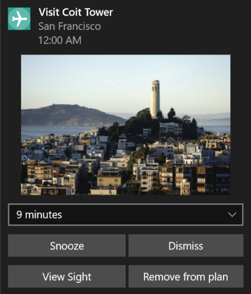

<a name="HOLTop" ></a>

# More Personal Computing and Shell Integration #
---

<a name="Overview"></a>
## Overview ##

**Windows 10** is the first step to an era of more personal computing. **Universal Windows Platform** (UWP) and the Windows 10 platform enables development of apps that interact with users in more human, natural ways, through speech, pen and touch.

In this module, we will enhance the Sights2See Travel app that was created in Module 1 of this UWP workshop. We will add inking and speech support to allow users to interact with the app in more natural ways. We will add an Interactive Toast which allows the user deeper integration with your app right from the Notification pane.

<a name="Objectives"></a>
### Objectives ###

In this module, we’re going to get hands-on experience implementing more personal ways for your C# UWP app to interact with the user. You will see how to:

- Add inking support
- Provide speech integration through Cortana
- Build an interactive notification that enables direct user actions

<a name="Prerequisites"></a>
### Prerequisites ###

The following is required to complete this module:

- Microsoft Windows 10 Build 14279 or later
- [Microsoft Visual Studio 2015 with Update 2 or later][1]

[1]: https://www.visualstudio.com/products/visual-studio-community-vs

---

<a name="Exercises" ></a>

## Exercises ##

This module includes the following exercises:

1.	[Inking](#Exercise1)
1.	[Cortana Integration and Speech Commands](#Exercise2)
1.	[Implementing interactive toast notifications](#Exercise3)


Estimated time to complete this module:  **40 to 50 minutes**

<a name="Exercise1"></a>
### Exercise 1: Inking ###

We will be implementing the following Inking features:
- Notes recorded using inking
- Inking on photos
- Ink Toolbar (preview of the RS1 Ink Toolbar for color and pen selection)
- Optical character recognition

<a name="Ex1Task1"></a>
#### Task 1 - Adding the ability for users to enter written notes ####

We'll start by adding an InkCanvas that can be used for taking notes.

1. Open the starter project at **C:\Labs\CodeLabs-UWP\Workshop\Module 2-MorePersonalComputing\Begin\Microsoft.Labs.SightsToSee** and open the solution file.

1.	Once the project has opened, set your Solution Configuration to **Debug** and your Solution Platform to **x86**. Select **Local Machine** from the Debug Target dropdown menu.

	

	_Configure your app to run on the Local Machine_
    
1. Run the starter project on the **Local Machine** and then exit the application.

	> **Note:** You may notice there is a new prompt for location as well as a BackgroundTasks project in the Solution. We'll be using these features later in the Module.

1.	We're going to enable Inking as an alternative to typing notes in the Sight Detail view.

	To that end, we've already added the boolean property **NotesAreInk** to the **Sight** model in the starter code to keep track of whether the user saved  the Notes field as text or Ink.

	We've also added an **IsNotesInking** boolean to the ViewModel to determine if we should display the notes entry field as text or Ink.

	Let's get started by added a simple InkCanvas to the Notes field.

1. Open **SightDetailPage.xaml** in the __Views__ folder of project __Microsoft.Labs.SightsToSee__.

1. Expand the **M2_EnableInkButton** snippet below the **Notes** title TextBlock. The button will go in the second column of the grid.

	(Code Snippet - _M2_EnableInkButton_)
	<!--mark:1-5-->
	````C#
	<Button x:Name="InkButton" Grid.Column="1" Background="Transparent" Click="{x:Bind ViewModel.EnableInk}"
		Visibility="{x:Bind ViewModel.IsNotesInking, Mode=OneWay, Converter={StaticResource InverseBooleanToVisibilityConverter}}">

		<FontIcon Glyph="&#xEC87;" FontFamily="Segoe MDL2 Assets" FontSize="20" />
	</Button>
	````

	> **Note:** The visibility of this button is tied to the **NotesAreInking** boolean through a **BooleanToVisibility** converter.

1. Expand the **M2_EnableInk** snippet in the **SightDetailPageViewModel**. This method will set the **IsNotesInking** bool to true. We're going to use this property to handle visibility for the Ink and Text elements.

	(Code Snippet - _M2_EnableInk_)
	<!--mark:1-3-->
	````C#
	public void EnableInk()
	{
		IsNotesInking = true;
	}
	````

1. Return to **SightDetailPage.xaml**. Expand the **M2_NotesInkCanvas** snippet below the Notes TextBox.

	(Code Snippet - _M2_NotesInkCanvas_)
	<!--mark:1-8-->
	````C#
	<Grid x:Name="InkGrid" 
		Grid.Row="1" 
		Background="White" 
		Visibility="{x:Bind ViewModel.IsNotesInking, Mode=OneWay, Converter={StaticResource BooleanToVisibilityConverter}}"
		Margin="0,8,0,0">

		<InkCanvas x:Name="NotesInkCanvas" MinHeight="500" />
	</Grid>
	````

	> **Note:** The InkCanvas is contained in a Grid with a white background, because the InkCanvas on its own would display with a transparent background.

1. In the **SightDetailPage** code-behind, expand the **M2_NotesInputs** snippet after `InitializeComponent()` in the constructor.

	(Code Snippet - _M2_NotesInputs_)
	<!--mark:1-4-->
	````C#
	// Set up the NotesInkCanvas input types
	NotesInkCanvas.InkPresenter.InputDeviceTypes = CoreInputDeviceTypes.Mouse |
			CoreInputDeviceTypes.Pen |
			CoreInputDeviceTypes.Touch;
	````
1. Build and run your app.

1. Select a Sight in the app, which navigates to the **SightDetailPage** showing details for a Sight and use the **EnableInkButton** that you added at the top right of the Notes field to change notes input to an InkCanvas.
    
    
    
    _The simple Notes InkCanvas_


The default pen for the InkCanvas is a simple black line. Right now, we are also not saving the Ink. In the next task, we're going to set up an Ink Toolbar to handle pen color, saving, and clearing the Notes Ink Canvas.

<a name="Ex1Task2"></a>
####  Task 2 – Add the Redstone Ink Toolbar ####

In Redstone, you'll have the option of adding the Redstone Ink Toolbar to any InkCanvas. We're going to use a preview of the toolbar for our Notes InkCanvas. The toolbar is customizable, so we'll also add our custom Save button to it.

1. Notice that the `xmlns:c="using:InkToolbarPreview"` namespace has been added to the top-level **&lt;Page&gt;** element at the top of **SightDetailPage.xaml**. We've added an **InkToolbar** example for image annotation, and it is also using this namespace. We've also added the `using InkToolbarPreview` namespace to the **SightDetailPage** code-behind.

1. Expand the **M2_InkToolbar** snippet after the EnableInkButton in **SightDetailPage.xaml**.

	(Code Snippet - _M2_InkToolbar_)
	<!--mark:1-21-->
	````C#
	<c:InkToolbar x:Name="NoteInkToolbar" Grid.Column="1"
					AutoPopulate="None"
					TargetInkCanvas="{x:Bind NotesInkCanvas}"
					Visibility="{x:Bind ViewModel.IsNotesInking, Mode=OneWay, Converter={StaticResource BooleanToVisibilityConverter}}"
					EraserClearAllInvoked="EraserClearAll">


		<c:InkToolbarEraserButton />
		<c:InkToolbarBallpointPenButton />

		<!--<c:InkToolbarCustomToggleButton Click="TryOCR">
			<FontIcon Glyph="&#xE8E9;" FontFamily="Segoe MDL2 Assets" />
		</c:InkToolbarCustomToggleButton>-->

		<c:InkToolbarCustomToggleButton Click="NotesSaveButton_Click">
			<FontIcon FontFamily="Segoe MDL2 Assets" Glyph="&#xE001;" />
		</c:InkToolbarCustomToggleButton>
		<c:InkToolbarCustomToggleButton Click="NotesUndoButton_Click">
			<FontIcon FontFamily="Segoe MDL2 Assets" Glyph="&#xE106;" />
		</c:InkToolbarCustomToggleButton>

	</c:InkToolbar>
	````

    > **Notes:** One of the buttons on the Toolbar is commented out. We'll enable it in the next task. For now, you can ignore it.

1. Open the **SightDetailPage** code-behind.

1. Scroll down to the `#region NotesInkToolbar` and expand the **M2_SaveUndo** snippet in the region.

	(Code Snippet - _M2_SaveUndo_)
	<!--mark:1-19-->
	````C#
	private async void NotesSaveButton_Click(object sender, RoutedEventArgs e)
	{
		 ViewModel.CurrentSight.NotesAreInk = true;
		 var file = await ViewModel.GenerateStorageFileForInk();
		 ViewModel.CurrentSight.InkFilePath = file.Path;
		 using (var stream = await file.OpenAsync(FileAccessMode.ReadWrite))
		 {
			  await NotesInkCanvas.InkPresenter.StrokeContainer.SaveAsync(stream);
		 }
		 await ViewModel.UpdateSightAsync(ViewModel.CurrentSight);
	}

	private async void NotesUndoButton_Click(object sender, RoutedEventArgs e)
	{
		 NotesInkCanvas.InkPresenter.StrokeContainer.Clear();
		 ViewModel.CurrentSight.NotesAreInk = false;
		 ViewModel.IsNotesInking = false;
		 await ViewModel.UpdateSightAsync(ViewModel.CurrentSight);
	}
	````

1. Locate and review the **NotesSaveButton_Click** method which sets the **NotesAreInk** property on the Sight to true and saves the ink strokes in a storage file.

1. Locate and review the **NotesUndoButton_Click** method  which clears all strokes, sets **NotesAreInk** and **IsNotesInking** to false, and returns to the text input method for Notes.

    > **Note:** The **EraserClearAll()** method already exists for the image annotation InkToolbar, so we are reusing it for the Notes Ink Toolbar clear method as well.

    > There is also a style already defined for the image annotation InkToolbar, which makes Red, Green, and Blue ink available. The style is defined in **SightDetailPage.xaml**.

1. Expand the **M2_SetupNotes** snippet inside the **SetupNotesInkAsync** task in the code-behind. This method restores Ink that has been saved to the Sight.

	(Code Snippet - _M2_SetupNotes_)
	<!--mark:1-14-->
	````C#
	// Check to see if we are in ink mode
	if (ViewModel.CurrentSight.NotesAreInk)
	{
		 ViewModel.IsNotesInking = true;

		 if (!string.IsNullOrWhiteSpace(ViewModel.CurrentSight.InkFilePath))
		 {
			  var file = await StorageFile.GetFileFromPathAsync(ViewModel.CurrentSight.InkFilePath);
			  using (var stream = await file.OpenAsync(FileAccessMode.ReadWrite))
			  {
					await NotesInkCanvas.InkPresenter.StrokeContainer.LoadAsync(stream);
			  }
		 }
	}
	````
    
1. Build and run the app. Use the Notes InkToolbar to change properties for the Ink canvas, save the Ink, and undo.

    
    
    _The InkToolbar_

<a name="Ex1Task3"></a>
#### Task 3 - Adding OCR Ink to text capability ####

Now that we've added the ability to record notes with Ink, it would be useful to recognize those notes as text. In this task, we're going to add the ability to use Optical Character Recognition to convert Ink notes to text.

1. Uncomment the remaining **InkToolbarCustomToggleButton** on the Notes InkToolbar in **SightDetailPage.xaml**. This button will pop open a dialog where the user can complete the speech recognition process.

1. Next, let's create the dialog. Expand the **M2_OcrDialog** snippet at the bottom of the main Grid in the **SightDetailPage** XAML.

	(Code Snippet - _M2_OcrDialog_)
	<!--mark:1-19-->
	````C#
	<ContentDialog x:Name="OCRDialog"
						PrimaryButtonText="Accept"
						SecondaryButtonText="Cancel"
						IsPrimaryButtonEnabled="False"
						Title="Text Recognition"
						d:IsHidden="True">
		 <StackPanel>
			  <ComboBox x:Name="RecoName"
							Header="Choose a recognizer:"
							MaxWidth="500"
							SelectionChanged="OnRecognizerChanged"
							Margin="0,4"/>
			  <Button Click="OnRecognizeAsync"
						 Margin="0,4">Recognize text</Button>
			  <TextBox x:Name="Status"
						  Header="Recognition Output:"
						  Margin="0,4"/>
		 </StackPanel>
	</ContentDialog>
	````

    This dialog lets the user choose a speech recognizer from those installed on the machine and use it to parse the Ink to text.

    If the result is acceptable, the user can select the primary key on the dialog to finalize the conversion. If not acceptable, the user can cancel and return to the InkCanvas.

1. Open the **SightDetailPage** code-behind and expand the **M2_Recognizers** snippet above the constructor.

    (Code Snippet - _M2_Recognizers_)
    <!--mark:1-2-->
    ````C#
	private readonly InkRecognizerContainer _inkRecognizerContainer;
	private readonly IReadOnlyList<InkRecognizer> _recoView;
    ````
    
1. In the constructor, find the `#region SetupRecognizers` and expand the **M2_SetupRecognizers** snippet inside of it. This code gets the list of all available recognizers on the device.

    (Code Snippet - _M2_SetupRecognizers_)
    <!--mark:1-19-->
    ````C#
	_inkRecognizerContainer = new InkRecognizerContainer();
	_recoView = _inkRecognizerContainer.GetRecognizers();
	if (_recoView != null)
	{
		 if (_recoView.Count > 0)
		 {
			  foreach (var recognizer in _recoView)
			  {
					RecoName?.Items?.Add(recognizer.Name);
			  }
		 }
		 else
		 {
			  RecoName.IsEnabled = false;
			  RecoName?.Items?.Add("No Recognizer Available");
		 }
	}

	RecoName.SelectedIndex = 0;
    ````
    
1. Scroll down to the `#region OCR`. Expand the **M2_RecognizerMethods** snippet inside the region.

    (Code Snippet - _M2_RecognizerMethods_)
    <!--mark:1-36-->
    ````C#
	private async void TryOCR(object sender, RoutedEventArgs e)
	{
		 var result = await OCRDialog.ShowAsync();
		 if (result == ContentDialogResult.Primary)
		 {
			  ViewModel.IsNotesInking = false;
			  ViewModel.CurrentSight.NotesAreInk = false;

			  // The last note is followed by a space.
			  ViewModel.CurrentSight.Notes += $" {Status.Text}";
			  await ViewModel.UpdateSightAsync(ViewModel.CurrentSight);
			  Status.Text = string.Empty;
			  NotesInkCanvas.InkPresenter.StrokeContainer.Clear();
		 }
	}

	private bool SetRecognizerByName(string recognizerName)
	{
		 var recognizerFound = false;

		 foreach (var reco in _recoView)
		 {
			  if (recognizerName == reco.Name)
			  {
					_inkRecognizerContainer.SetDefaultRecognizer(reco);
					recognizerFound = true;
					break;
			  }

			  if (!recognizerFound)
			  {
					Status.Text = $"Could not find target recognizer: {recognizerName}.";
			  }
		 }
		 return recognizerFound;
	}
    ````

1. Then expand the **M2_RecognizerChanged** snippet inside the **OnRecognizerChanged** method.

    (Code Snippet - _M2_RecognizerChanged_)
    <!--mark:1-3-->
    ````C#
	var selectedValue = (string)RecoName.SelectedValue;
	Status.Text = string.Empty;
	SetRecognizerByName(selectedValue);
    ````

    - The **TryOCR** method opens the **OCRDialog** when the user selects the button from the Notes InkToolbar. It awaits the result from the dialog: will the user accept the recognized text or cancel?

    - The **OnRecognizerChanged** method clears the Status TextBlock in the OCRDialog and calls the SetRecognizerByName method.

    - The **SetRecognizerByNameMethod** sets the default recognizer to the user's selection if it exists on the device.

1. Expand the **M2_OnRecognize** snippet inside the **OnRecognizeAsync** method.

    (Code Snippet - _M2_OnRecognize_)
    <!--mark:1-32-->
    ````C#
	var currentStrokes =
		 NotesInkCanvas.InkPresenter.StrokeContainer.GetStrokes();
	if (currentStrokes.Count > 0)
	{
		 RecoName.IsEnabled = false;

		 var recognitionResults = await _inkRecognizerContainer.RecognizeAsync(
			  NotesInkCanvas.InkPresenter.StrokeContainer,
			  InkRecognitionTarget.All);

		 if (recognitionResults.Count > 0)
		 {
			  // Display recognition result
			  var str = string.Empty;
			  foreach (var r in recognitionResults)
			  {
					str += $"{r.GetTextCandidates()[0]} ";
			  }
			  Status.Text = str;
			  OCRDialog.IsPrimaryButtonEnabled = true;
		 }
		 else
		 {
			  Status.Text = "No text recognized.";
		 }

		 RecoName.IsEnabled = true;
	}
	else
	{
		 Status.Text = "Must first write something.";
	}
    ````

    - The **OnRecognizeAsync** method sends the ink strokes (if any) to the ink recognizer container and awaits the results of **RecognizeAsync**.

    - If results are returned, they are built into a string and displayed in the **Status** TextBlock in the OCR Dialog.

    - Results also enable the Primary dialog button, which allows the user to accept the conversion.

    - If there are no results, an error message is given.

    - If there is no ink to recognize, an error message is given.

1. Build and run the app. Write text on the Notes InkCanvas, and try converting it with the recognizer.

1. When you receive a result from the recognizer, accept the results to return to a Notes TextBox with the new results appended.
    
    
    
    _Recognize handwritten text with OCR_
    
<a name="Exercise2"></a>
### Exercise 2: Cortana Integration and Speech Commands ###

<a name="Ex2Task1"></a>
#### Task 1 -  Voice Commands to launch App in the foreground ####

Voice commands give your users a convenient, hands-free way to interact with your app. We're going to begin by adding a simple voice command that launches the app. Then we'll explore more advanced scenarios with a voice command service that returns results in the Cortana window without launching the app.

1. You'll notice that there is a new **BackgroundTasks** project in the solution. We'll be using that later on for the **VoiceCommandService**, but for now we'll be working in the **SightsToSee** project.

1. We've already added a new XML file in the main directory of the **SightsToSee** project called **VoiceCommands.xml**. This file is the voice command definition file that will define the voice command schema. We're going to create a simple schema with a voice command that launches the app.

1. Open **VoiceCommands.xml**. Expand the **M2_LaunchCommand** snippet below the XML namespace declaration. This code creates a voice command set for en-us.

    (Code Snippet - _M2_LaunchCommand_)
    <!--mark:1-22-->
    ````C#
	<VoiceCommands xmlns="http://schemas.microsoft.com/voicecommands/1.2">
	  <CommandSet xml:lang="en-us" Name="SightsToSeeCommandSet_en-us">
		 <AppName>Sights to See</AppName>
		 <Example>Sights to see, Show me my sights</Example>

		 <Command Name="LaunchApp">
			<Example>show me my sights</Example>
			<ListenFor RequireAppName="BeforeOrAfterPhrase">Show me my [selected] [chosen] {destinations}</ListenFor>
			<Feedback>Opening your Sights To See app</Feedback>
			<Navigate />
		 </Command>

		 <PhraseList Label="destinations">
			<Item>sights</Item>
			<Item>sightseeing</Item>
			<Item>sightseeing attraction</Item>
			<Item>sightseeing attractions</Item>
			<Item>Sights To See destination</Item>
		 </PhraseList>

	  </CommandSet>
	</VoiceCommands>
    ````
    
    > **Note:** We have added en-us as the language for this example, but you can add additional command sets within the same VCD. For instance, the language tag for Germany would be `xml:lang="de-de"`. The list of regions and languages that Cortana supports is at http://windows.microsoft.com/en-us/windows-10/cortanas-regions-and-languages.

    > If you choose to add another command set in a supported language, make sure to add an equivalent command in that language every time you add one to the en-us command set throughout this demo.

    We've given the command set the prefix "Sights To See." This prefix tells Cortana to listen for commands related to the app.

    The explicitly specified `<AppName>`

    - Acts as a command prefix

    - Lets you specify a user-friendly name for the app

    - Enables explicit placement of the app name within a voice command

    Within the command,

    - The square [] brackets denote optional words

    - The curly {} brackets act as a placeholder for a phrase list. Any item in the phrase list can be used in the command.

    - The `RequireAppName="BeforeOrAfterPhrase"` attribute means the app name can be spoken at the beginning or end of the command.

    > **Note:** The Navigate element signifies that the app will launch in the foreground. The alternative to launching in the foreground is to define a WinRT component to handle behind-the-scenes interactions with app data through Cortana. You can learn more about Voice Command Definitions at https://msdn.microsoft.com/en-us/library/windows/apps/dn722331.aspx

1. Open **App.xaml.cs**. We are going to register the VCD file. Expand the **M2_LoadVCD** snippet below the `// Insert the M2_LoadVCD snippet here` comment in the **OnLaunched()** method.

    (Code Snippet - _M2_LoadVCD_)
    <!--mark:1-2-->
    ````C#
	var storageFile = await Windows.Storage.StorageFile.GetFileFromApplicationUriAsync(new Uri("ms-appx:///VoiceCommands.xml"));
	await Windows.ApplicationModel.VoiceCommands.VoiceCommandDefinitionManager.InstallCommandDefinitionsFromStorageFileAsync(storageFile);
    ````

    > **Note:** You will need to launch the app once normally to register the VCD each time you make changes to it.

1. Expand the **M2_VoiceActivation** snippet below the `// Insert the M2_VoiceActivation snippet here` comment in the **OnActivated()** method. This creates a switch based on **ActivationKind.VoiceCommand**.

    (Code Snippet - _M2_VoiceActivation_)
    <!--mark:1-4-->
    ````C#
	case ActivationKind.VoiceCommand:
		 VoiceCommandActivatedEventArgs voiceArgs = args as VoiceCommandActivatedEventArgs;
		 HandleVoiceCommand(args);
		 break;
    ````

1. Expand the **M2_HandleVoiceCommand** snippet below the **OnActivated** method. This snippet creates a switch based on the voice command as it is understood by Cortana. Additionally, it writes the recognized command and the spoken text to the console.

    (Code Snippet - _M2_HandleVoiceCommand_)
    <!--mark:1-27-->
    ````C#
	private void HandleVoiceCommand(IActivatedEventArgs args)
	{
		 var commandArgs = args as VoiceCommandActivatedEventArgs;
		 var speechRecognitionResult = commandArgs.Result;
		 var command = speechRecognitionResult.Text;

		 var voiceCommandName = speechRecognitionResult.RulePath[0];
		 var textSpoken = speechRecognitionResult.Text;

		 Debug.WriteLine("Command: " + command);
		 Debug.WriteLine("Text spoken: " + textSpoken);

		 string parameter;
		 switch (voiceCommandName)
		 {
			  case "LaunchApp":
					parameter = new TripNavigationParameter { TripId = AppSettings.LastTripId }.GetJson();
					AppShell.Current.NavigateToPage(typeof(TripDetailPage), parameter);

					break;

			  // Insert the M2_NearbyCase snippet here

			  default:
					break;
		 }
	}
    ````

1. Build and run the app to register the VCD. Close the app.

1. Tap the microphone icon to the right of the Cortana pane and speak one of the variations of the launch command, for example say: "Sights to See, Show me my sights". The app should launch and navigate to the main page.

<a name="Ex2Task2"></a>
#### Task 2 -  Voice Commands to interact with your App in the background ####

1. Now that we've created a typical launch scenario, let's take a look at more advanced scenarios.

    We've added a **BackgroundTasks** project to the starting code.

    - The project is a Windows Runtime Component

    - It contains a class called **VoiceCommandService**, which serves as the entry point to the background task

    - The **VoiceCommandService** is registered in the app manifest as an app service.

1. Let's take a look at the app service declaration. Open the **Package.appxmanifest**. On the **Declarations** tab, the **VoiceCommandService** is declared as an app service with the entrypoint **BackgroundTasks.VoiceCommandService**.

   The **BackgroundTasks** project has also been added as a reference in the **SightsToSee** project.

   The **SightsToSee.Library** project is referenced in the BackgroundTasks project.

1. We're going to add a second voice command to the VCD. This command will be handled by the service.

    Open **VoiceCommands.xml**. Expand the **M2_NearbyCommand** snippet immediately below the closing tag of the  **LaunchApp** command.

    (Code Snippet - _M2_NearbyCommand_)
    <!--mark:1-22-->
    ````C#
	<Command Name="NearbySights">
	  <Example>Show me the closest sightseeing attractions</Example>
	  <ListenFor>Show me nearby sights</ListenFor>
	  <ListenFor>{where} [my] [the] {nearby} {destinations}</ListenFor>
	  <ListenFor>What's my nearest sightseeing attraction</ListenFor>
	  <ListenFor>Which of my sights are near here</ListenFor>
	  <ListenFor RequireAppName="ExplicitlySpecified">Show me the {nearby} {builtin:AppName} attractions</ListenFor>
	  <Feedback>Hold on, let me check</Feedback>
	  <VoiceCommandService Target="VoiceCommandService" />
	</Command>

	<PhraseList Label="where">
	  <Item>Show me</Item>
	  <Item>Where's</Item>
	  <Item>Where is</Item>
	</PhraseList>

	<PhraseList Label="nearby">
	  <Item>nearest</Item>
	  <Item>closest</Item>
	  <Item>nearby</Item>
	</PhraseList>
    ````
    
    This command uses phrase lists and several `<ListenFor>` nodes to provide a variety of options for the user to access the command.

    The `RequireAppName="ExplicitlySpecified"` attribute allows you to place the app name within the voice command instead of at the beginning or end.

    > **Note:** The app name is defined in the `<AppName>` tag at the top of the VCD file. The app name is required for the **RequireAppName** attribute to work. Reference the placement of the app name within the command using `{builtin:AppName}`.

1. Open **App.xaml.cs** and expand the **M2_NearbyCase** snippet in the **voiceCommandName** switch under the **LaunchApp** case.

    Now we are ready to handle the incoming voice command in the **VoiceCommandService**.

    (Code Snippet - _M2_NearbyCase_)
    <!--mark:1-5-->
    ````C#
	case "NearbySights":
		 parameter = new TripNavigationParameter { TripId = AppSettings.LastTripId }.GetJson();
		 AppShell.Current.NavigateToPage(typeof(TripDetailPage), parameter);

		 break;
    ````

1. Open **Background Tasks > VoiceCommandService.cs**.

    - We've set up the **VoiceCommandService** to implement the **IBackgroundTask** interface and handle task cancellation.

    - The deferral in the background task ensures that the task will run uninterrupted to completion.

    - The **Run()** method is the entry point to the task.

1. Make the **Run()** method **async**.

1. Expand the **M2_TriggerDetails** snippet inside the **Run()** method.

    (Code Snippet - _M2_TriggerDetails_)
    <!--mark:1-26-->
    ````C#
	var triggerDetails = taskInstance.TriggerDetails as AppServiceTriggerDetails;

	if (triggerDetails != null && triggerDetails.Name == "VoiceCommandService")
	{
		 try
		 {
			  _voiceServiceConnection = VoiceCommandServiceConnection.FromAppServiceTriggerDetails(triggerDetails);

			  _voiceServiceConnection.VoiceCommandCompleted += OnVoiceCommandCompleted;

			  // Insert the M2_HandleNearbySights snippet here

		 }
		 catch (Exception ex)
		 {
			  var userMessage = new VoiceCommandUserMessage();
			  userMessage.SpokenMessage = "Sorry, I can't do that right now - something went wrong.";
			  // useful for debugging
			  userMessage.DisplayMessage = ex.Message;

			  var response = VoiceCommandResponse.CreateResponse(userMessage);

			  response.AppLaunchArgument = "LaunchApp";
			  await _voiceServiceConnection.ReportFailureAsync(response);
		 }
	}
    ````

    - We are checking the trigger details to see if the name matches the name of the App Service registration from the app manifest. If so, we implement a try-catch block.

    > **Note:** The subscription to the **VoiceCommandCompleted** event is in this code block, because it must take place after the **voiceServiceConnection** is set.

1. Our voice service connection is set up and we are handling completion and cancellation. Now we can handle the particular case of the NearbySights command.

    We've added a **SightsHelper** to the **Services** directory in the **SightsToSee.Library** project to assist with locating nearby sights. Let's take a look at the helper.

    What this helper does:

    - Finds the shortest route from the current location to a sight based on walking distance or driving distance

    - Provides tasks that iterate through the Sights in the trip to find the closest Sight or Sights

1. Expand the **M2_GetNearest** snippet after the **Run()** method. This adds a number of methods that implement the logic required to handle this voice command.

    (Code Snippet - _M2_GetNearest_)
    <!--mark:1-65-->
    ````C#
	private static async Task<List<Sight>> GetNearestSights(Geoposition pos)
	{
		 var datamodelService = DataModelServiceFactory.CurrentDataModelService();

		 // we are just loading the default trip here
		 var trip = await datamodelService.LoadTripAsync(AppSettings.LastTripId);
		 var nearest = await SightsHelper.FindClosestSightsAsync(pos.Coordinate.Point, trip, false);
		 return nearest;
	}

	private async Task ReportFailureToGetCurrentLocation()
	{
		 ...
	}

	private async Task ReportFailureToGetSights()
	{
		 ...
	}

	private async Task ShowNearestResults(List<Sight> nearest)
	{
		 ...
	}
    ````

    The **ShowNearestResults** task:
    
    - Returns a written and spoken message to the user

    - Creates **VoiceCommandContentTiles** that display the name, description, and image for the nearest Sights

    - Displays the content tiles to the user in the Cortana pane

1. Now we can set up the switch to handle the **NearbySights** case in the **Run()** method. We're going to call the methods we just added.

    Expand the **M2_HandleNearbySights** snippet inside the **Try** block in the **Run()** method.

    (Code Snippet - _M2_HandleNearbySights_)
    <!--mark:1-46-->
    ````C#
	VoiceCommand voiceCommand = await _voiceServiceConnection.GetVoiceCommandAsync();

	switch (voiceCommand.CommandName)
	{
		 case "NearbySights":
			  GeolocationAccessStatus accessStatus;
			  try
			  {
					// If we call this before the app has granted access, we get an exception
					accessStatus = await Geolocator.RequestAccessAsync();
			  }
			  catch
			  {
					// ensure we have a value
					accessStatus = GeolocationAccessStatus.Unspecified;
			  }
			  if (accessStatus == GeolocationAccessStatus.Allowed)
			  {

					var geolocator = new Geolocator();
					var pos = await geolocator.GetGeopositionAsync(TimeSpan.FromMinutes(5), TimeSpan.FromSeconds(5));
					if (pos != null)
					{
						 var nearest = await GetNearestSights(pos);
						 if (nearest != null && nearest.Any())
						 {
							  await ShowNearestResults(nearest);
						 }
						 else
						 {
							  await ReportFailureToGetSights();
						 }
					}
					else
					{
						 await ReportFailureToGetCurrentLocation();
					}
			  }
			  else
			  {
					await ReportFailureToGetCurrentLocation();
			  }
			  break;
		 default:
			  break;
	}
    ````
    
    What it does:

    - Checks to see if we have permission to use the user's location

    - If we have permission, get the location and use it to get the nearest Sights

    - If nearby Sights are returned, call the **ShowNearestResults** method to display them to the user.

1. Build and run your app to register the new VCD. Close the app.

1. Ask Cortana to show nearby Sights: say "Show me the nearest Sights to See attractions". Cortana will display the closest Sights as content tiles.

    
    
    _Nearby Sights display as content tiles in the Cortana pane_
    
<a name="Exercise3"></a>
### Exercise 3: Implementing interactive toast notifications ###

<a name="Ex3Task1"></a>
#### Task 1 – Implementing interactive toast notifications ####

Toast notifications are a great way to quickly interact with a user outside of an app. In this task, we're going to build and trigger a toast notification for a Sight when it is added to My Sights.

1.	Open **SightDetailPage.xaml** and expand the **M2_DatePicker** snippet after the **Caption** TextBlock. This snippet includes a **CalendarDatePicker** and **TimePicker**.

    (Code Snippet - _M2_DatePicker_)
    <!--mark:1-4-->
    ````C#
	<StackPanel Orientation="Horizontal" Grid.Row="0">
		 <CalendarDatePicker Date="{x:Bind ViewModel.CurrentSightDate, Mode=TwoWay}" />
		 <TimePicker Time="{x:Bind ViewModel.CurrentSightTime, Mode=TwoWay}" />
	</StackPanel>
    ````
  

    We've created variables in the ViewModel for **CurrentSightTime** and **CurrentSightDate** that return the visit date and time stored for the sight. If the date is null, it will return **DateTime.Now**.

1. In the **Services > TileNotificationsService** folder, open **ScheduledNotificationService.cs**. We've provided this class to help build the notification.

    What it does:

    - Builds the XML for the toast

    - Creates the toast notifier

    - Adds the toast to the schedule to display 30 seconds from now

    - Defines four actions the user can take

    > **Note:** The toast is set to always display 30 seconds from the time it is triggered to make it easy to test.

1. Open the **SightDetailPageViewModel**. In the **AddSightAsync()** method, expand the **M2_ScheduleToast** snippet as the first item in the method. This snippet calls the **ScheduledNotificationService** to create and send a toast notification and it passes it the current Sight.

    (Code Snippet - _M2_ScheduleToast_)
    <!--mark:1-5-->
    ````C#
	// Add CurrentSightTime and schedule toast notification
	if (CurrentSightDate.HasValue)
		 CurrentSight.VisitDate = CurrentSightDate.Value.Date.Add(CurrentSightTime);

	ScheduledNotificationService.AddToastReminder(CurrentSight);
    ````
    
1. When the toast arrives, it would be useOnActivatedful if the user could go straight into the Sight Details from the toast.

1. Open **App.xaml.cs**. Expand the **M2_ToastActivation** snippet as a case in the `switch (args.Kind)` in the **OnActivated()** override.

    (Code Snippet - _M2_ToastActivation_)
    <!--mark:1-15-->
    ````C#
	case ActivationKind.ToastNotification:
		 var toast = args as ToastNotificationActivatedEventArgs;

		 var props = toast.Argument.Split(':');
		 if (props[0] == "View")
		 {
			  var tripParam = new TripNavigationParameter { TripId = AppSettings.LastTripId, SightId = Guid.ParseExact(props[1], "D") }.GetJson();
			  AppShell.Current.NavigateToPage(typeof(TripDetailPage), tripParam);
		 }
		 else if(props[0] == "Remove")
		 {
			  var tripParam = new TripNavigationParameter { TripId = AppSettings.LastTripId, SightId = Guid.ParseExact(props[1], "D"), DeleteSight = true }.GetJson();
			  AppShell.Current.NavigateToPage(typeof(TripDetailPage), tripParam);
		 }
		 break;
    ````

1. Build and run your app. Open the Sight details for a sight that has not been added to My Sights.

1. Use the **+** button in the app bar to add the sight to your sights. This action will trigger the **ScheduleNotificationService** to send a toast notification. The notification will appear in 30 seconds with the Sight details.

1. Click the toast to launch the app.

    
    
    _The interactive toast notification_

<a name="Summary"></a>
## Summary ##

By completing this module, you should have:

- Added inking support
- Provided speech integration through Cortana
- Built an interactive notification that enables direct user actions
