<a name="HOLTop" ></a>

# Connected Apps: Across Devices and App-to-App #
---

<a name="Overview"></a>
## Overview ##

Windows 10 Redstone comes with more ways than ever before to create great user experiences across devices and across apps.
In this module, you will learn how to connect your app to the cloud so users can get their data on whichever device they pick up. 
You will enhance the app to load additional app data through an App Extension, and you will use the LaunchUri and LaunchForResults APIs to get directions from BingMaps and to connect to a photo processing apps to add effects to pictures.

You will add capabilities to the app to share files and content with other apps by adding support for Drag and Drop and the Share contract.

<a name="Objectives"></a>
### Objectives ###

In this module, you will see how to:

- Connect the app to the cloud
- Fetch resources from an App Extension
- Launch another app using LaunchUri
- Connect to another app using LaunchUriForResults
- Add drag and drop support to the app
- Use the Share contract to share content with other apps

<a name="Prerequisites"></a>
### Prerequisites ###

The following is required to complete this module:

- Microsoft Windows 10 Build 14279 or later
- Microsoft Visual Studio 2015 Update 2 or later
- Windows SDK Build 14279 or later

---

<a name="Exercises" ></a>

## Exercises ##

This module includes the following exercises:

1. [Connecting the app to an Azure App Service Mobile Apps cloud backend](#Exercise1)
1. [Loading resources from App Extensions](#Exercise2)
1. [Launching other apps using Launch Uri and Launch for Results](#Exercise3)
1. [Sharing files and content with other apps](#Exercise4)


Estimated time to complete this module:  **40 to 50 minutes**.

<a name="Exercise1"></a>
### Exercise 1: Connecting the app to an Azure App Service Mobile Apps cloud backend ###

<a name="Ex1Task1"></a>
#### Task 1 - Connect the app to the cloud ####

The UWP makes it easy to create an app that runs across many different device families, but when designing a mobile app, you should think about how you will create a **Connected Mobile Experience** for your users. Users should enjoy a great experience from your app whichever of their devices they use, and for many apps that means you will need to store some data in the cloud. 

You can store data in the user's OneDrive, or store small amounts of data in the roaming folders and settings, but for a fully featured mobile Backend as a Service, you can use Microsoft Azure App Service Mobile App. In the [Azure portal](http://portal.azure.com), you can easily create a mobile REST service backed by cloud storage such as SQL Azure and implement authentication, push notifications and more, with support for cross-platform clients.

Unfortunately, time does not allow us to cover creation of the backend service nor a deep dive on the code to interact with the backend service, but in this task you will connect the app to a pre-built backend service. To learn more about creating and programming an Azure App Service Mobile App, see [https://azure.microsoft.com/en-us/documentation/learning-paths/appservice-mobileapps/](https://azure.microsoft.com/en-us/documentation/learning-paths/appservice-mobileapps/).

1. Open the starter project at **C:\Labs\CodeLabs-UWP\Workshop\Module3-ConnectedApps\Source\Begin\Microsoft.Labs.Sights2See\Microsoft.Labs.Sights2See.sln**.

1.	Once the project has opened, set your Solution Configuration to **Debug** and your Solution Platform to **x86**. Select **Local Machine** from the Debug Target dropdown menu.
 
    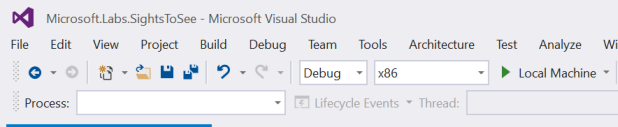
    
    _Configure your app to run on the Local Machine_

1. If you have run through modules 1 and 2 of this workshop, you will have been working with an app that only stored data locally, in a SQLite database stored in the local folder for the app. This means that when the user selects sights for their trip, or enters notes or ink annotations, they take effect only on the device where the app is running. If the user opens the same app on a different device, all their work entered on the original device is not visible. This is not a good connected mobile experience.

    You will now switch the app to store data using Azure Mobile Apps APIs. These connect to the cloud service to store data. 

    Switching has been made easy in this app because all data storage operations are encapsulated in a data model service, described by an interface we have created called **IDataModelService**. You can find this interface in the **Microsoft.Labs.SightsToSee.Library** project, in **Services\DataModelService\IDataModelService.cs**. Up until now in this workshop, the app has been using SqliteDataModelService which implements IDataModelService and which stores data locally. You will now switch to use AzureDataModelService which implements the same interface but which works against the cloud.

1. In the **Services\DataModelService** folder, open **DataModelServiceFactory.cs**. As you can see, this class selects either SqliteDataModelService or AzureDataModelService dependent on the value of the **SQLITE** preprocessor directive.

	````C#
    public static class DataModelServiceFactory
    {
		private static IDataModelService _dataModelService;

		public static IDataModelService CurrentDataModelService()
		{
		    if (_dataModelService == null)
		    {
#if SQLITE
		        _dataModelService = new SqliteDataModelService();
#else
		        _dataModelService = new AzureDataModelService();
#endif
		    }

		    return _dataModelService;
		}
    }
	````

1. Right-click the **Microsoft.Labs.SightsToSee.Library** Project and then click **Properties** on the context menu to open the Properties window. Select the **Build** tab, and select **All Platforms** in the **Platform** dropdown. Edit the **Conditional compilation symbols** to remove **SQLITE**. 
 
    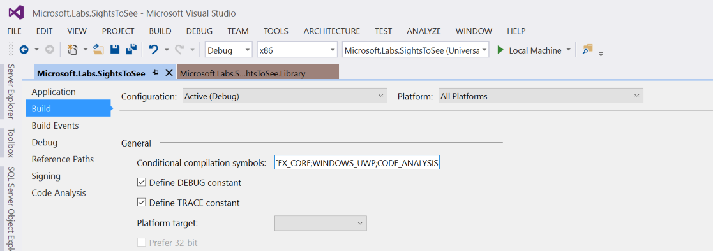
    
    _Remove SQLITE from Conditional compilation symbols_

1. Repeat this for the **Microsoft.Labs.Sights2See** project properties. There are a few changes to the logic in this project to handle initialization of the cloud service storage at the appropriate time of app startup, and these changes  are also conditional on the SQLITE preprocessor directive being undefined.

1. Rebuild the solution and run the project on the local machine. You will see the app startup and the first thing it does is connects to the cloud to try to synchronize data, but you will see an error message that Sync fails.
 
    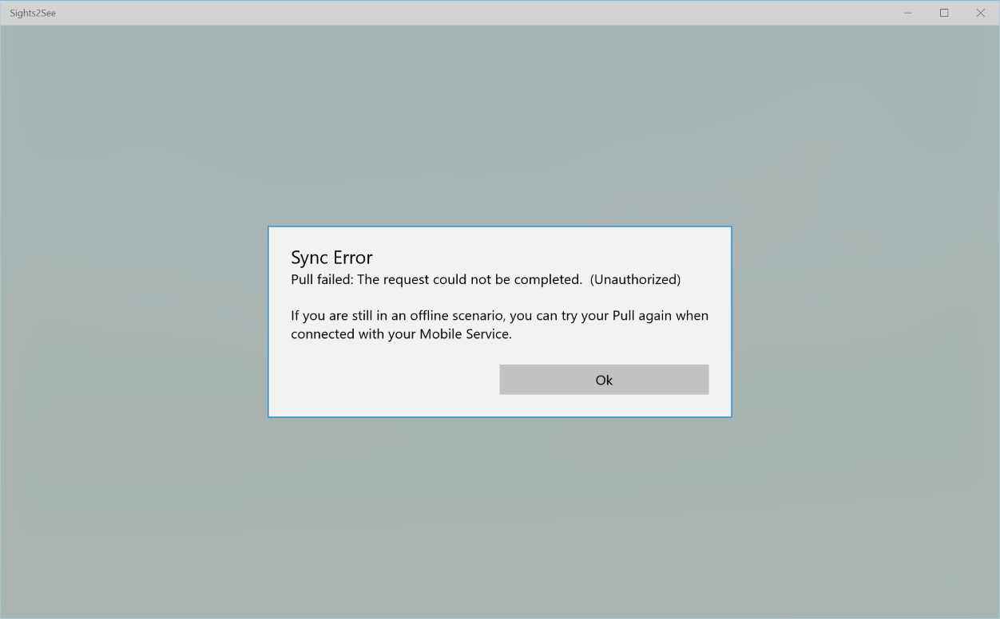
    
    _Sync fails with an Unauthorized error_

   The sync fails because the Azure App Service Mobile Apps service has been configured to require authentication using Microsoft Account credentials, and we do not have any logic in the app yet to perform authentication and to get an authorization token that it can then pass to the Azure backend in order to get access to the service.
   
   Authentication is required to identify each user of the application so that data stored in the SQL Azure database (the cloud data backing store for this service) can be partitioned per user effectively. In the Trip object definition in the cloud service, there is an extra column of **User** which is set by the backend logic based on the authenticated identity.
   
   Note that although this service has been setup to require Microsoft Account authentication, Azure App Service Mobile App also supports authentication against Twitter, Google, Facebook, Azure Active Directory or a custom authentication provider.

<a name="task2"></a>
### Task 2 - Implement authentication 

In this task, you will enable client-directed authentication for this application. With an Azure App Service Mobile App, you can set up your app so that the server handles the authentication process whereby the client calls the backend service and the service displays the login dialog to the end user.

In this application, you will enable client-directed authentication, where the client app handles authentication, gets the authorization token and then passes that to the backend service with every service request. By doing this on the client side, we can use the UWP **WebAuthenticationCoreManager** API to perform the authentication, which has the advantage that if run on a system where the user has already logged in with a Microsoft Account, the app can get an authentication token without prompting the user for credentials - a true Single Sign On (SSO) experience.

1. In the **Microsoft.Labs.Sights2See.Library** project, open file **Services\DataModelService\AzureDataModelService.cs**. Find the method **AuthenticateAsync** and uncomment the call to the AuthenticationService where directed, and remove or comment out the last two lines of this method. It should now look like the following.

	````C#
    public async Task<Tuple<bool, string>> AuthenticateAsync()
    {
        await InitializeAsync();

        // Authentication required for the cloud storage
        // M3_Exercise_1_Task_2
        // UNCOMMENT the next line
        return await new AuthenticationService(this.client).AuthenticateAsync();

        // This is the async equivalent of an empty method body
        // M3_Exercise_1_Task_2
        // REMOVE the next two lines
        //await Task.FromResult(true);
        //return Tuple.Create(true, string.Empty);
    }
	````
    
1. Right-click **AuthenticationService** in the code line you have just uncommented, and then click **Go to Definition** in the context menu. 

    Examine the class you have just opened. You will see that it includes code for either server-directed or client-directed authentication, with the latter enabled currently because the SERVER_INITIATED compilation constant is not currently defined. You can uncomment the #define at the top of this class later on in your own time, if you want to see the user experience that offers.

    However, in this workshop, we are using the client-directed authentication stream which is further down in the class. The **MSAAuthenticationHelper** class at the bottom of this code file shows how to use the UWP **WebAuthenticationCoreManager** API to get an authorization token for a Microsoft Account, which it will be able to do silently if the user has already signed onto their Windows 10 device using MSA credentials.
   
1. Before you run the app again, as a precaution UNINSTALL the app from your system. This will ensure that the WebAuthenticationCoreManager identoty provider sees your app as a new one and initializes correctly. Click the Windows button bottom left, click **All Apps** and navigate to the Sights2See app in the apps list. Right-click the Sights2See app and then click **Uninstall**.
     
    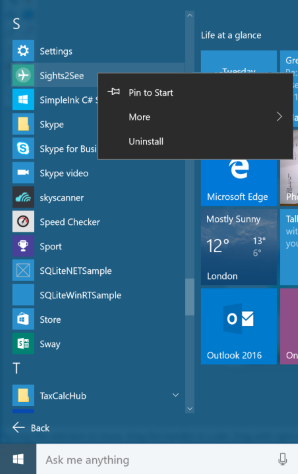
    
    _Uninstall the Sights2See app_
    
1. Run the app again. This time you will be prompted for credentials if you are logged onto a Windows 10 device and you haven't used Microsoft Account credentials to do so, or if your machine account has already authenticated using MSA credentials, you will connect to the cloud service silently.
      
    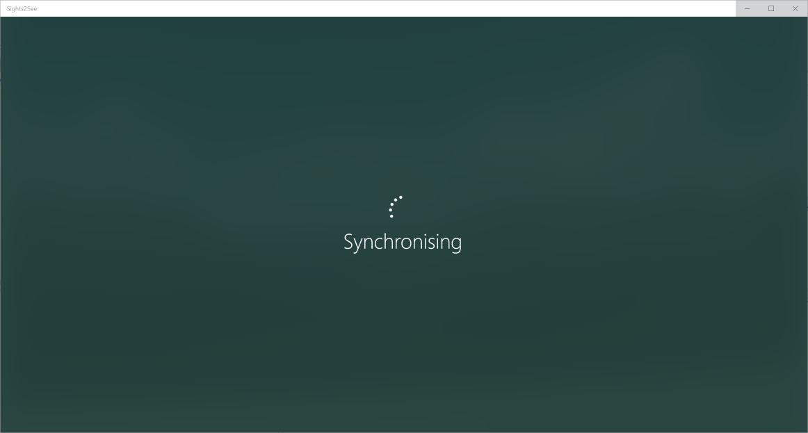

    _Synchronizing data with the cloud service_
    
1. Now, use the app as normal: select some Sights for your trip, enter some Notes on a sight, use inking to annotate a picture. Next you will view those same changes on a different device!

<a name="task3"></a>
### Task 3 - Run the connected app on different devices, synchronizing data through the cloud 

With your data stored in the cloud, now the user can enjoy your app whichever of their devices they pick up.

1. Close the app if it is still running.

1. Now either select the **Mobile Emulator Preview 10.0.14291.0 WVGA 4inch 512MB** device in the target dropdown, or if you want to use a real phone, connect the phone to your PC using a USB cable and then change the Solution Platform to **ARM** and select **Device** as the output device.

1. Run the app from Visual Studio and it will launch on your mobile emulator or real Windows 10 mobile device. You will have to log in with MSA credentials and then the app will synchronize with the cloud. You will see the same selection of Sights and the same inking annotations you created previously on the PC.

<a name="Exercise2"></a>
### Exercise 2: Loading resources from App Extensions ###

<a name="Ex2Task1"></a>
#### Task 1 – Fetch resources from an App Extension ####

App Extensions allow you to add data to your application from other UWP Store apps. An extension app exposes its extension in the app manifest and indicates the available data. The host app indicates in its manifest that it is looking to consume that type of data.

You can install and uninstall extension apps while the host app is running, and it will raise appropriate events to add and remove data as required without relaunching.

For this module, we've added a project called **AdditionalSights** to the solution. The AdditionalSights app is an extension app that provides six more Sights in a **json** file.

Let's take a look at how the extension app is set up.

1. Open the AdditionalSights **Package.appxmanifest** as code.

	> **Note:** The extension type we're using is in preview, so it isn't yet available in the Manifest Editor.

	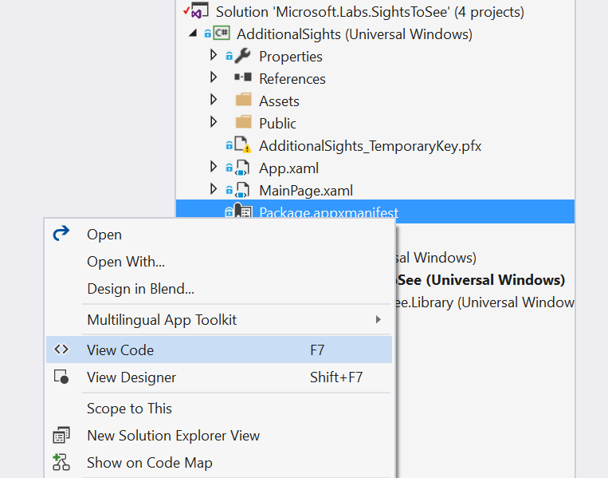

	_View the Package manifest as code_

1. The extension is declared in the manifest with the category **windows.appExtension**. It exposes up a name, display name, description, and **Public** folder. The Public folder is where we'll find the consumable data.

	````XML
	<Extensions>
		  <uap3:Extension Category="windows.appExtension">
			 <uap3:AppExtension Name="SanFranPack.1.0" Id="base" PublicFolder="Public" DisplayName="Sights To See San Francisco" Description="Additional sights to see in San Francisco" />
		  </uap3:Extension>
	</Extensions>
	````

1. Expand the **Public** folder. You will see the json file containing additional Sights. We'll install the extension app later on.

1. Let's move over to **SightsToSee**, which is our host app. Open the SightsToSee **Package.appxmanifest** as code.

1. Expand the **M3_ExtensionHost** snippet inside the **Extension** node. This code declares the SightsToSee app as a host for extensions with the name **SanFranPack.1.0**.

	(Code Snippet - _M3_ExtensionHost_)

    ````XML
    <uap3:Extension Category="windows.appExtensionHost">
        <uap3:AppExtensionHost>
            <uap3:Name>SanFranPack.1.0</uap3:Name>
        </uap3:AppExtensionHost>
    </uap3:Extension>
    ````

1. In the **SightsToSee** app, open the helper **Services > App Extensions > ExtensionManager.cs**. We've provided this helper to manage the loading and unloading of extensions.

	##### **Initialize()** #####

	- We're going to call **Initialize** from **App.xaml.cs**.

	- This is where we hook up event handlers to deal with adding and removing app extensions.

	- Extensions can be loaded and unloaded dynamically while the host app is running.

	- By default, when you call **Initialize** on app startup, it will load extensions that have already been installed. The event handlers handle loading and unloading of extensions that are installed or uninstalled after that point.

	##### Scroll down to the **Load** task #####

	- If an extension is enabled but not yet loaded, this task will check to make sure it is OK to load.

	- It will then create a local copy of the json file from the extension app and load the new Sights into the trip.

	##### Unload #####

	- The **Unload** task first gets the data again from the extension app

	- It uses a lock to make sure the user can't rerun the code until it has completed

	> **Note:** Code inside a **lock** can't be awaited.

	- It then checks the Sights in the extension file against the existing Sights in the app. If they are not in **My Sights**, the extension Sights will be removed.

1. Now that we've seen how extensions work and that we have the helper to support loading and unloading, we can set up the app to do the work. Open **App.xaml.cs**

1. Expand the **M3_ExtensionManager** snippet anywhere in the **App** class. This code creates a new ExtensionManager to handle extensions with the name **SanFranPack.1.0** and sets up an ExtensionManager property that we can access.

	(Code Snippet - _M3_ExtensionManager_)

	````C#
	public ExtensionManager ExtensionManager
	{
		 get { return _extensionManager; }
	}

	private ExtensionManager _extensionManager = new Facts.ExtensionManager("SanFranPack.1.0");
	````

1. In the **OnLaunched** method, expand the **M3_Initialize** snippet after the VCD load. This line will call the **Initialize()** method in the ExtensionManager helper on app startup.

	(Code Snippet - _M3_Initialize_)

	````C#
	ExtensionManager.Initialize();
	````

1. We've added some basic options to the app settings page to support loading and unloading of app extensions. Open **Views > SettingsPage.xaml**. Uncomment the **Extensions ListView**. This list will populate when extensions are available.

1. Open **ViewModels > SettingsPageViewModel.cs**. Uncomment the **Extensions ObservableCollection**.

1. Deploy the **SightsToSee** app and run it from the Start Menu. Navigate to the **Settings** page. You can see that the Extensions list is empty. Before we can load the extension, it first needs to be installed on the machine. You can install an extension app directly from the Windows Store, sideload it, or deploy it if you have the source code.

    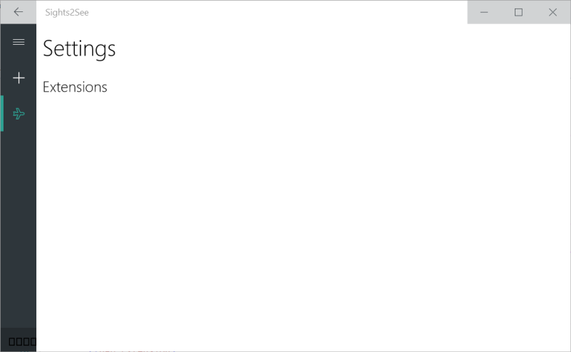

    _The extensions list is empty until an extension app is installed_

1. Since we have the source code, Deploy the **AdditionalSights** project to install it. Keep the **Settings** page open as it deploys.

    > **Note:** You can sideload an appx bundle with PowerShell commands.

    - As soon as the **AddtionalSights** app is installed, it appears in the **Extensions** list. Use the toggle to enable it.

    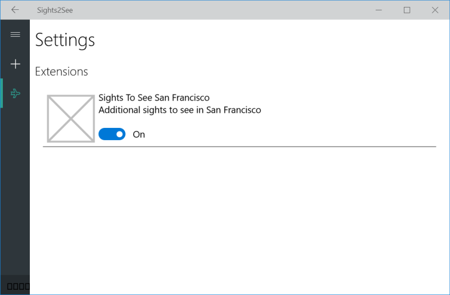

    _Enable the extension app_

1. Open your San Francisco trip to see the new Sights that have been added. Add one to **My Sights**.

1. Find the **AdditionalSights** app in the **Start Menu**. Right-click and uninstall it.

    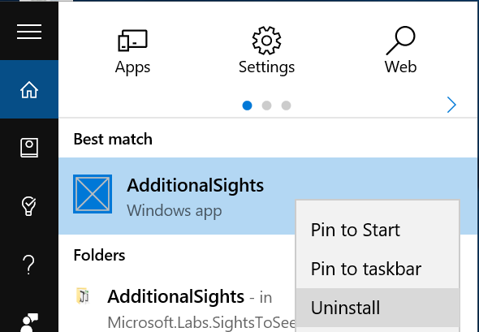

    _Uninstall the extension app_

1. Return to the San Francisco trip. Any additional Sights that weren't added to My Sights will have been removed.

<a name="Exercise3"></a>
### Exercise 3: Launching other apps using Launch Uri and Launch for Results ###

Inter-app communication can be used to:

- Launch links in a Web browser

- Send an email with context from an app

- Report errors

- Call out to services

Your system has default programs set to open certain URI protocols. You can also define custom protocols.

We're going launch the Maps app and use it to get directions to a Sight. Then we'll use a custom URI protocol and package family name to launch a specific app, pass in a photo, and return the processed photo to one of our Sights.

<a name="Ex3Task1"></a>
#### Task 1 - Launch another app using LaunchUri ####

Let's start with a simple LaunchUri scenario.

1.	Open **SightDetailPage.xaml** and expand the **M3_DirectionsButton** snippet in the **TitleCommandBar**.

	(Code Snippet - _M3_DirectionsButton_)

	````C#
	<AppBarButton x:Name="Directions"
					  Label="Directions to Sight"
					  Click="{x:Bind ViewModel.GetDirectionsAsync}">
		 <AppBarButton.Icon>
			  <FontIcon FontFamily="Segoe MDL2 Assets" Glyph="&#xE707;" />
		 </AppBarButton.Icon>
	</AppBarButton>
	````

1. Expand the **M3_MobileDirectionsButton** snippet in the **MobileCommandBar**.

    > **Note:** There are two command bars because of the adaptive design of the app. Current design guidelines recommend that Mobile command bars appear at the bottom of the page and that Desktop command bars appear at the top.

	(Code Snippet - _M3_MobileDirectionsButton_)

	````C#
	<AppBarButton Click="{x:Bind ViewModel.GetDirectionsAsync}"
					  Label="Directions to Sight">
		 <AppBarButton.Icon>
			  <FontIcon FontFamily="Segoe MDL2 Assets" Glyph="&#xE707;" />
		 </AppBarButton.Icon>
	</AppBarButton>
	````

1. The app bar buttons you just added are hooked up to a **GetDirectionsAsync** method in the view model. In the next step, we'll create that method.

1. Open the **SightDetailPageViewModel**. Expand the **M3_GetDirections** snippet anywhere in the view model.

	(Code Snippet - _M3_GetDirections_)

	````C#
	public async void GetDirectionsAsync()
	{
		 var mapsUri =
			  new Uri($@"bingmaps:?rtp=~pos.{CurrentSight.Latitude}_{CurrentSight.Longitude}_{CurrentSight.Name}");

		 // Launch the Windows Maps app
		 var launcherOptions = new LauncherOptions();
		 launcherOptions.TargetApplicationPackageFamilyName = "Microsoft.WindowsMaps_8wekyb3d8bbwe";
		 await Launcher.LaunchUriAsync(mapsUri, launcherOptions);
	}
	````

	What it does:

	- The mapsUri is set to use the bingmaps: protocol.

	- The mapsUri uses a query to pass the current Sight's latitude, longitude, and name.

		> **Note:** the mapsUri string is constructed using C# 6 string interpolation.

	- We're using **LauncherOptions** to specify a package family name for the target app. The package family name ensures that only the official Maps app will launch.

		> **Note:** If you leave out the package family name, your user can choose between all apps on the system that uses the protocol specified in the launch URI.

	- **LaunchUriAsync** starts the app associated with the bingmaps protocol and the package family name defined in the LauncherOptions.

1. Build and run your app. Open a Sight detail page and use the directions button on the app bar to launch the Maps app.

    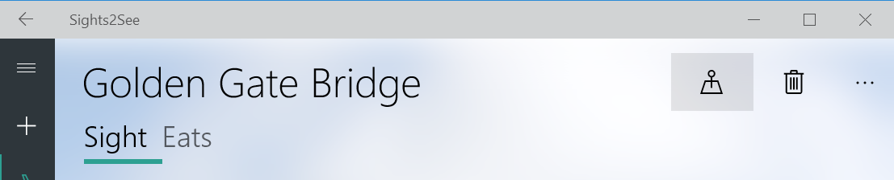

    _Use the Directions button on the app bar to launch the Maps app and get directions to the Sight_

<a name="Ex3Task2"></a>
#### Task 2 - Connect to another app using LaunchUriForResults ####

Beyond launching a target app and passing it data, we can launch an app and receive results back. We're going to add a button to the InkToolbar we're using for image annotation and use it to launch a photoprocessing app. The photoprocessing app will apply a Lumia filter to the image and return the altered version to our SightsToSee app.

1. Before we can launch the photoprocessing app, we need to install it on the system. Open the **&lt;LabRoot&gt;\Module3\Begin\ImageProcessingApp\PhotoEditingLaunchForResults.sln** solution.

1. Set the **QuickStart** project as the **StartUp Project** if it isn't already. The QuickStart app applies a black and white Lumia filter to a photograph and allows the user to adjust brightness.

1. Build and deploy the **QuickStart** app.

    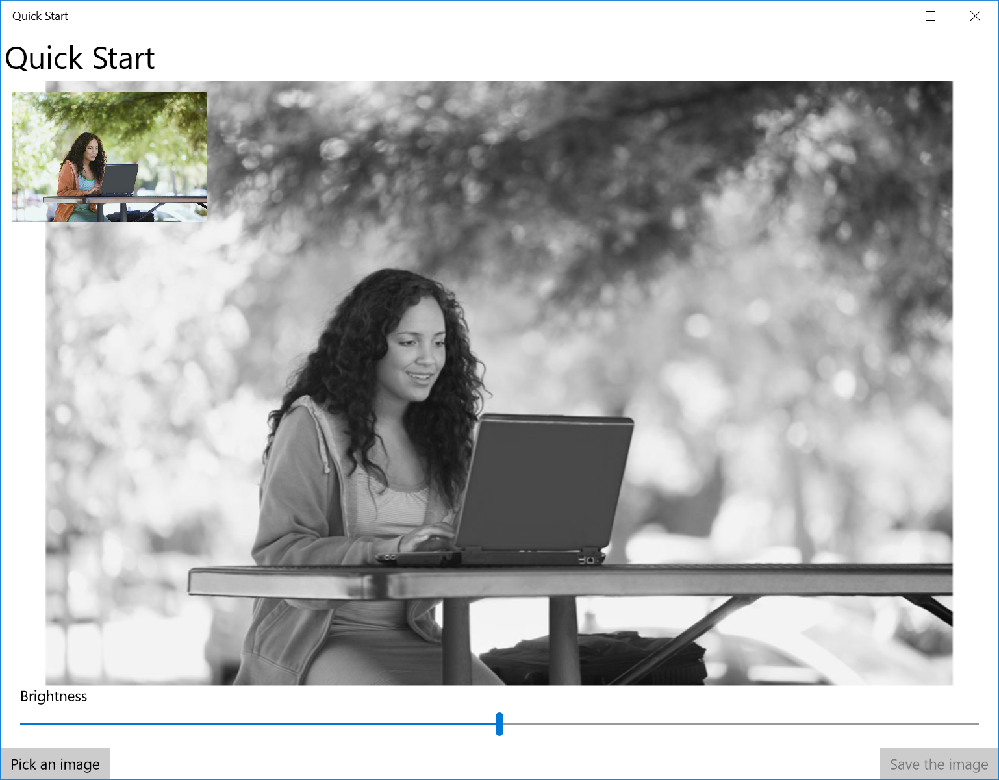

    _The QuickStart app_

1. Return to the **SightsToSee** Module 3 solution and open **SightDetailPage.xaml**.

1. Add a new button to the ImageInkToolbar by expanding the **M3_LaunchButton** snippet after the Undo button.

	(Code Snippet - _M3_LaunchButton_)

	````C#
	<inkToolbarPreview:InkToolbarCustomToggleButton Click="OnLaunchForResults">
		 <FontIcon FontFamily="Segoe MDL2 Assets" Glyph="&#xE2AC;" />
	</inkToolbarPreview:InkToolbarCustomToggleButton>
	````

1. Open the **SightDetailPage** code-behind. Find the **OnLaunchForResults** event handler.

1. Expand the **M3_OpenPicker** snippet inside the event handler.

	(Code Snippet - _M3_OpenPicker_)

	````C#
	FileOpenPicker openPicker = new FileOpenPicker();
	openPicker.ViewMode = PickerViewMode.Thumbnail;
	openPicker.SuggestedStartLocation = PickerLocationId.PicturesLibrary;
	openPicker.FileTypeFilter.Add(".jpg");
	openPicker.FileTypeFilter.Add(".jpeg");
	openPicker.FileTypeFilter.Add(".png");

	StorageFile file = await openPicker.PickSingleFileAsync();
	````

    What it does:

    - Creates a new **FileOpenPicker** in thumbnail mode

    - Sets the suggested start location to the user's **Picture Library**

    - Looks for files of type **jpg**, **jpeg**, and **png**

    - Creates a storage file to save the user's image selection locally

1. Now that we have an image, we can send it to our photoprocessing app. Expand the **M3_LaunchForResults** snippet below the previous snippet in the **OnLaunchForResults** event handler.

	(Code Snippet - _M3_LaunchForResults_)

	````C#
    if (file != null)
    {
		//Send data to the service 
		var token = SharedStorageAccessManager.AddFile(file);

		var message = new ValueSet();

		//For QuickStart
		message.Add("Token", token);

		var targetAppUri = new Uri("lumiaphotoeditingquick:");

		// We want a specific app to perform our photo editing operation, not just any that implements the protocol we're using for launch
		var options = new LauncherOptions();
		options.TargetApplicationPackageFamilyName = "3ac26f24-3747-47ef-bfc5-b877b482f0f3_gd40dm16kn5w8";

		var response = await Launcher.LaunchUriForResultsAsync(targetAppUri, options, message);

		if (response.Status == LaunchUriStatus.Success)
		{
		    if (response.Result != null)
		    {
		        string alteredFileToken = response.Result["Token"].ToString();
		        var alteredFile = await SharedStorageAccessManager.RedeemTokenForFileAsync(alteredFileToken);

		        // get the destination where this file needs to go
		        var sightFile = await ViewModel.CreateSightFileAndAssociatedStorageFileAsync();

		        // Get the destination StorageFile
		        var destFile = await StorageFile.GetFileFromApplicationUriAsync(new Uri(sightFile.Uri));

		        // save the edited image file at the required destination
		        await alteredFile.CopyAndReplaceAsync(destFile);
		        sightFile.FileType = SightFileType.ImageGallery;

		        await ViewModel.SaveSightFileAsync(sightFile);
		    }
		}
    }
	````

    What it does:

    - If the user has chosen a valid file, it is added as a token to a ValueSet

    - The target app Uri is specified

    - The package family name is specified in the LauncherOptions

    - We await the results of LaunchUriForResultsAsync

    - If the response status is Success, we copy the new image file to the local folder and add it to the Sight record.

1. Build and run your app. Open a Sight detail page and use the **LaunchForResults** button on the ImageInkToolbar to launch the file picker.

    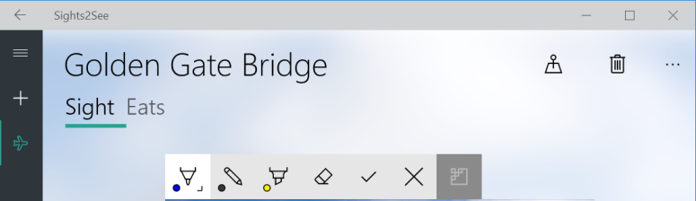

    _The LaunchForResults Button_

1. Select an image from the filesystem. When the QuickStart app opens, set a brightness level for the modified image.

1. Use the **Save the image** button to save and return the image to the SightsToSee app. You will see the modified image appear in the Sight gallery.


<a name="Exercise4"></a>
### Exercise 4: Sharing files and content with other apps ###

<a name="Ex4Task1"></a>
#### Task 1 – Adding drag and drop support to the app ####

Adding drag and drop is a quick way to make your app more user-friendly. We're going to add drag and drop capability to the gallery grid in the SightDetailPage so users can easily add new photos to a Sight.

1. Open **SightDetailPage.xaml** and find the **GalleryGrid**.

1. Add the **AllowDrop**, **Drop**, and **DragOver** attributes to the opening tag of the GalleryGrid (type or copy/paste):

	````XAML
	AllowDrop="True"
	Drop="{x:Bind ViewModel.SightFile_DropAsync}"
	DragOver="{x:Bind ViewModel.SightFile_DragOver}"
	````

	What it does:

	- **AllowDrop="True"** enables the GalleryGrid as a drop target

	- We are wiring up the Drop and DragOver events to methods in the view model. We'll add those methods in the following steps.

1. Open the **SightDetailPageViewModel**. Expand the **M3_DragOver** snippet anywhere in the view model.

	(Code Snippet - _M3_DragOver_)

	````C#
	public void SightFile_DragOver(object sender, DragEventArgs e)
	{
		 e.AcceptedOperation = DataPackageOperation.Copy;

		 // Customize the look of the DragUI
		 if (e.DragUIOverride != null)
		 {
			  e.DragUIOverride.Caption = "Attach photo";
			  e.DragUIOverride.IsCaptionVisible = true;
			  e.DragUIOverride.IsContentVisible = true;
			  e.DragUIOverride.IsGlyphVisible = true;
		 }
	}
	````

    What it does:

    - Enables the **Copy** operation for the originator of the drag event

    - Handles the **DragOver** event

    - Customizes the **DragUI** with a caption and content preview

1. Expand the **M3_DropAsync** snippet below the DragOver event handler.

    What it does:

    - Copies the incoming storage items to the local folder

    - Calls the **AddSightFileAsync** task, which creates and saves a SightFile record for each new image

    - **AddSightFileAsync** also adds each new image to the CurrentSightFiles observable collection, so they will appear immediately in the gallery grid.

    > **Note:** You can drag and drop multiple images at once.

1. Build and run the app. Drag and drop an image or multiple images onto the gallery grid in a Sight detail view.

    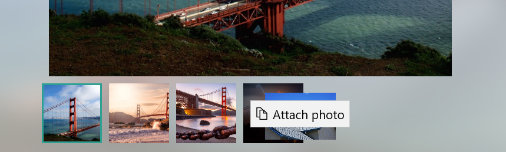

    _Drag and drop to add images to the Sight gallery_

<a name="Ex4Task2"></a>
#### Task 2 – Using the Share contract to share content with other apps ####

The Share contract is an easy way to share data between apps. You can share links, text, photos, and videos. We're going to add a Share button to the Sight detail app bar to share the sight name, photo, and description in HTML format.

> **Note:** Visit http://msdn.microsoft.com/en-us/library/windows/apps/hh465251.aspx to read the guidelines on sharing content in UWP apps.

1. Add the app share button to the command bar in **SightDetailPage.xaml**. There are two command bars: one for Mobile and one for larger windows.

    - Expand the **M3_ShareButton** snippet into the **TitleCommandBar**.

		(Code Snippet - _M3_ShareButton_)

		````C#
		<AppBarButton x:Name="Share"
						  Label="Share Sight"
						  Click="{x:Bind ViewModel.ShareSight}">
			 <AppBarButton.Icon>
				  <FontIcon FontFamily="Segoe MDL2 Assets" Glyph="&#xE72D;" />
			 </AppBarButton.Icon>
		</AppBarButton>
		````


    - Expand the **M3_MobileShareButton** snippet into the **MobileCommandBar**.

		(Code Snippet - _M3_MobileShareButton_)

		````C#
		<AppBarButton Click="{x:Bind ViewModel.ShareSight}"
					    Label="Share Sight" 
                        Foreground="White"
                        Style="{StaticResource TopCmdBtnStyle}">
			 <AppBarButton.Icon>
				  <FontIcon FontFamily="Segoe MDL2 Assets" Glyph="&#xE72D;" />
			 </AppBarButton.Icon>
		</AppBarButton>
		````

1. Now let's add the code to support the share button. Open the **SightDetailPageViewModel** and expand the **M3_ShareSight** snippet anywhere in the ViewModel.

	(Code Snippet - _M3_ShareSight_)

	````C#
	public void ShareSight()
	{
		 var dataTransferManager = DataTransferManager.GetForCurrentView();
		 dataTransferManager.DataRequested += DataTransferManager_DataRequested;

		 DataTransferManager.ShowShareUI();
	}
	````


    **What it does:**

    - The DataTransferManager initiates an exchange of content with other apps.

    - **GetForCurrentView()** returns the DataTransferManager associated with the current window.

    - We're also subscribing to the **DataRequested** event, which occurs when a share operation starts.

    - **ShowShareUI** opens the system Share flyout.

1. With the **ShareSight()** method, we've initiated the share operation. Next, we'll handle the **DataRequested** event. Expand the **M3_DataRequested** snippet below the **ShareSight** method.

    > **Note:** The Request property lets you access the DataRequest object and give it data or a failure message.

	(Code Snippet - _M3_DataRequested_)

	````C#
	private void DataTransferManager_DataRequested(DataTransferManager sender, DataRequestedEventArgs args)
	{
		 var request = args.Request;
		 request.Data.Properties.Title = $"I'm visiting the {CurrentSight.Name}";
		 request.Data.Properties.Description = $"{CurrentSight.Description}";
		 request.Data.SetText($"{CurrentSight.Description}");

		 var localImage = SightImage.UriSource.AbsoluteUri;
		 string htmlPayload = $"<p>{CurrentSight.Description}</p>";
		 var htmlFormat = HtmlFormatHelper.CreateHtmlFormat(htmlPayload);
		 request.Data.SetHtmlFormat(htmlFormat);

		 // Because the HTML contains a local image, we need to add it to the ResourceMap.
		 var streamRef = RandomAccessStreamReference.CreateFromUri(new Uri(localImage));
		 request.Data.ResourceMap[localImage] = streamRef;
	}
	````

    **What it does:**

    -  Sets the Data title and description fields to the current Sight name and description

    - Creates an HTML payload string with the **src** of the `````` tag set to the absolute URI of the Sight image

    - Formats the payload string as HTML

    - Adds the localImage to the ResourceMap

1. Build and run the app. Open a Sight detail view and use the **Share** button to initiate the Share process.

    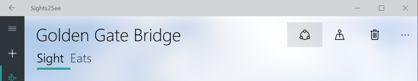

    _Use the Share button to open the Share contract_


<a name="Summary"></a>
## Summary ##

In this module, we connected the app to the cloud and loaded additional app data through an App Extension. We also added LaunchUri and LaunchForResults scenarios to get directions from BingMaps and process photos that we added to the Sights.

Finally, we enhanced the user experience by adding Drag and Drop and the Share contract.
